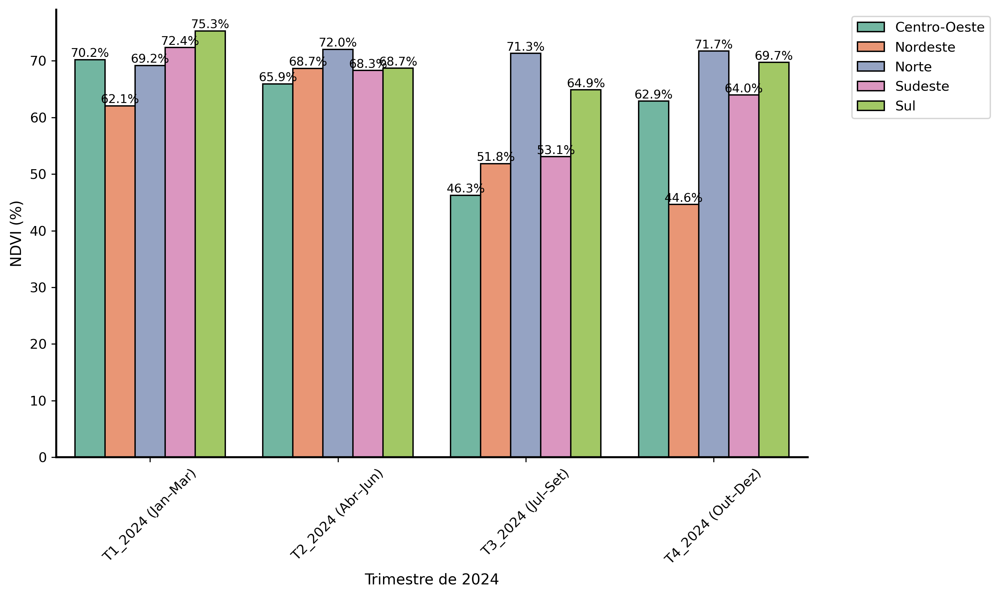
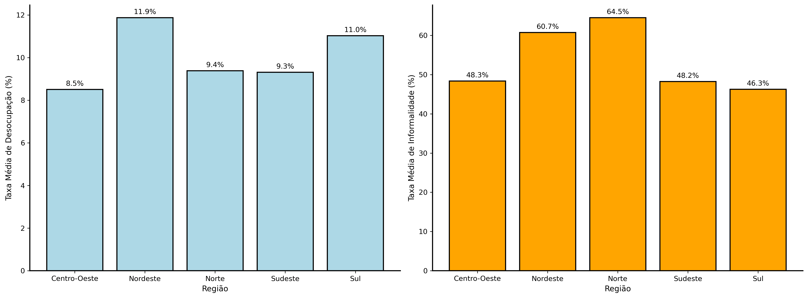
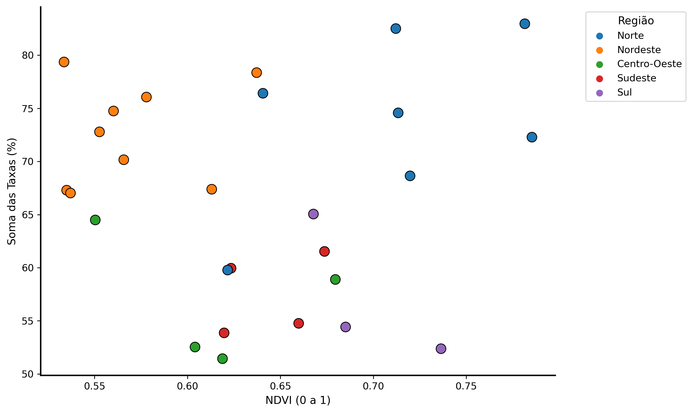
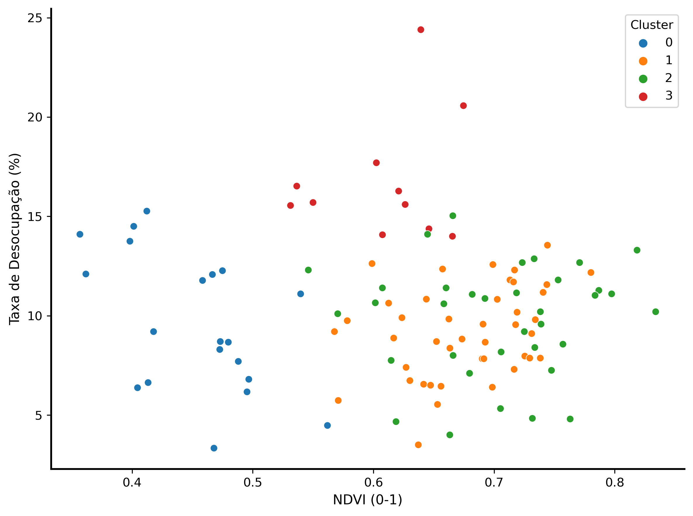
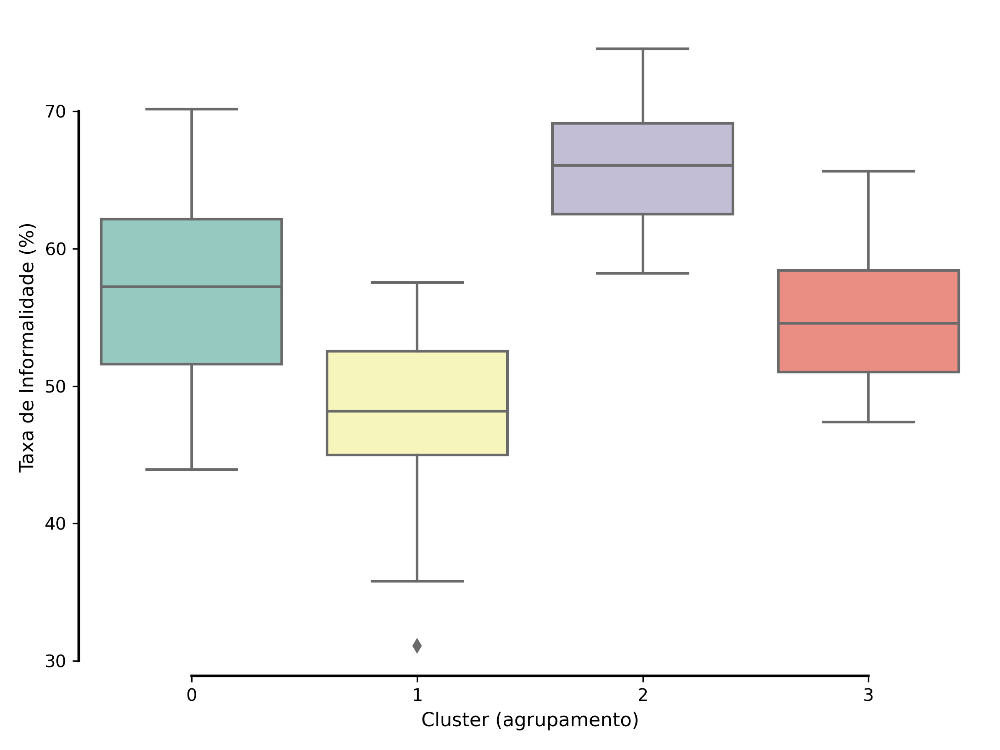
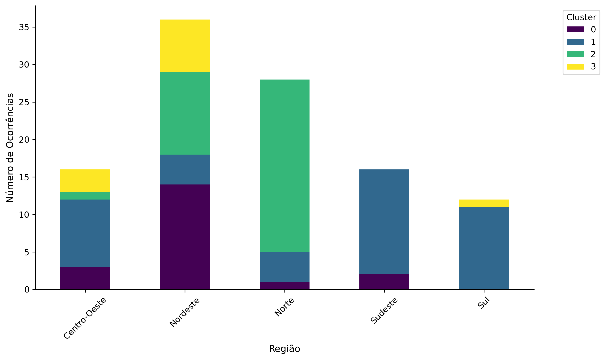

# 🌱 NDVI, Empregabilidade Verde e Políticas Públicas Sustentáveis no Brasil

## O Que Se Faz Aqui?

Este repositório apresenta a análise da relação entre a cobertura vegetal (NDVI) e os indicadores de vulnerabilidade socioeconômica no Brasil. Com base em dados públicos do Google Earth Engine (NDVI/MODIS) e PNADC/IBGE (2024), segmentamos os estados em clusters homogêneos e estimamos os investimentos necessários para promover empregabilidade verde em regiões prioritárias, considerando o salário mínimo de R$ 1.518,00 por 6 meses.

## Por Quê?

A crise climática e o desemprego afetam desproporcionalmente as regiões mais vulneráveis do Brasil. Ao integrar dados ambientais e socioeconômicos, este projeto propõe uma abordagem baseada em evidências para auxiliar gestores públicos a planejar políticas de reflorestamento urbano que também promovam inclusão produtiva, em conformidade com os Objetivos de Desenvolvimento Sustentável (ODS 8 e 13) e práticas ESG.

## Como?

As etapas principais do projeto foram:

1. **Coleta e Integração de Dados**: Download e tratamento de dados do NDVI via GEE e taxas de desocupação/informalidade via PNADC/IBGE.
2. **Análise Estatística e Clusterização**: Aplicação de K-Means para agrupamento socioambiental dos estados brasileiros.
3. **Modelagem de Custo de Empregabilidade Verde**: Estimativa de valores necessários para contratação temporária da população desocupada por cluster.
4. **Visualizações**: Geração de gráficos temáticos para facilitar a comunicação dos resultados.

---

## 📊 Figuras Geradas

### 1. Variação Trimestral do NDVI por Região

### 2. Taxas Médias de Desocupação e Informalidade por Região

### 3. Dispersão NDVI × Soma das Taxas de Desocupação + Informalidade

### 4. Dispersão NDVI × Desocupação por Cluster

### 5. Boxplot da Taxa de Informalidade por Cluster

### 6. Distribuição dos Clusters por Região

### 7. Custo Estimado para Empregabilidade Verde por Cluster

---

## 🗂 Estrutura do Repositório

---

## 👩‍💻 Autora

Amanda Morais — MBA em Data Science e Analytics (USP ESALQ)  
Projeto final sob orientação acadêmica, com aplicação prática para políticas públicas sustentáveis.  
Contato: [LinkedIn](https://www.linkedin.com/in/amandalearte)

---

## 📎 Referências

- IBGE - Pesquisa Nacional por Amostra de Domicílios Contínua (PNADC), 2024  
- Google Earth Engine - MODIS/NDVI (MOD13Q1), 2024  
- Ramires (2015), Castro (2012), Ojima & Marandola (2010), Li et al. (2021), entre outros citados no TCC

